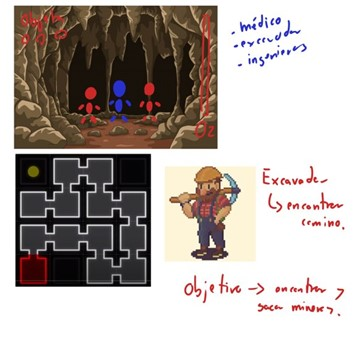
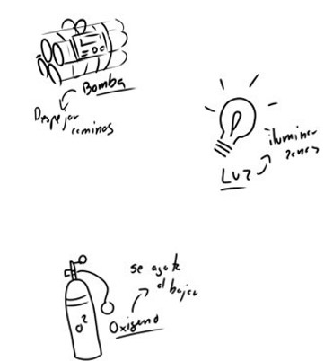
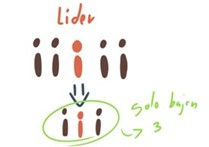
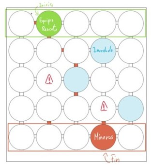
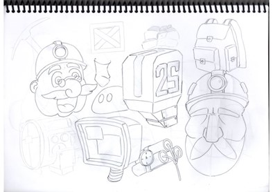
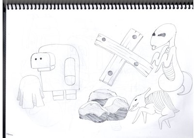
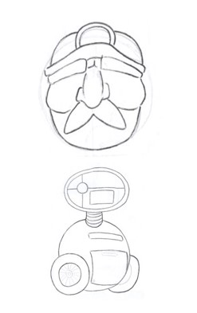
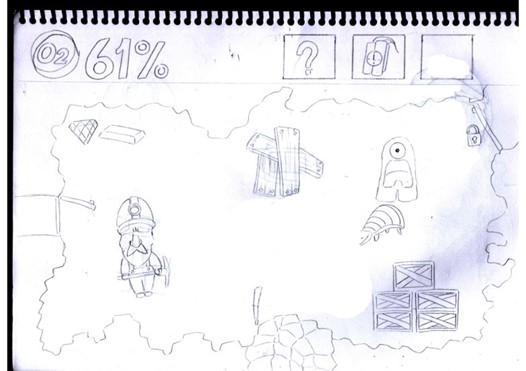
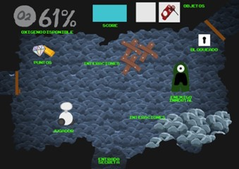
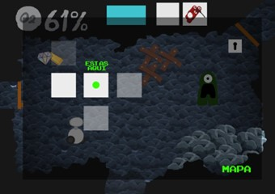

# Idea Seleccionada

Luego de analizar las diferentes ideas se escogio la mejor. 

## Rescate de mineros 
> *** Objetivo *** Grupo de rescatistas tienen que bajar por mineros atrapados en cueva
> 
> *** Género: *** Mazmorras, hay que bajar y volver
> *** Límite de tiempo: *** Oxígeno

### Primeras ideas de los elementos del juego 

Podrían existir varios personajes, por ejemplo: 

-	Médico 
-	Ingeniero  
-	Excavador
-	Buceador    
También, cada personaje tiene una habilidad, solo pueden bajar 3 (se puede intercambiar)

Se resta oxígeno al moverse, recolectar
Recoger partes de bomba para conseguirla
Toda la cueva a oscuras, se pueden iluminar zonas con el objeto de luz (bengala)

### Boceto de la idea inicial del juego 

## Diseño de ambiente y personajes

### Primeras ideas del diseño de los personajes

### Primeras ideas del diseño de los escenarios 

