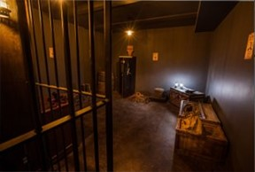
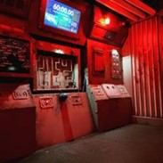
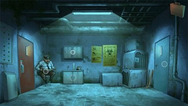
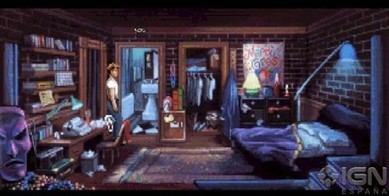
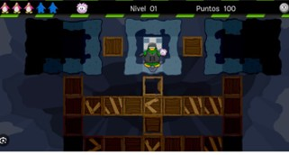
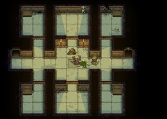
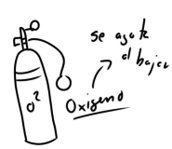
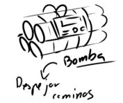

# Todas las ideas 

:::info

Se plantearon 4 ideas para el videojuego de este parcial. Luego se desarrollaron mejor las dos mejores ideas para elegir la mejor. 
:::

### Scape Room
> *** Objetivo: *** Reunir pistas, herramientas para escapar de la habitación antes de que se termine el tiempo
>
> *** Género: *** Aventura Gráfica

### Rescate de mineros 
> *** Objetivo: *** Grupo de rescatistas tienen que bajar por mineros atrapados en cueva
>
> *** Género: *** Mazmorras, hay que bajar y volver.

### Lostty 
> *** Objetivo: *** Un gatito se ha perdido y termina en un mundo desconocido, e intenta regresar con su dueña 
>
> *** Género: *** Aventura

### Juegos de laberinto con obstáculos
> *** Objetivo: *** Consta de llegar a las ultimas celdas a diferencia que en cada celda habrá herramientas para avanzar más rápido y habrá trabas que retrasen o exista la posibilidad de perder el juego. 
>
> *** Género: *** Aventura

#  Descripción de las mejores ideas 

### Scape Room
*** Elementos ***
-	Habrá un tiempo límite para escapar de la habitación.
-	Los objetos se pueden combinar para armar herramientas de escape.
-	Cada cierto tiempo una figura terrorífica aparece en escena y el jugador desde esconderse en alguna parte de la habitación.
-	Tendrá una historia de fondo.
- Esta figura terrorífica puede cambiar la posición de los objetos en la habitación.

*** Imagenes de referencia ***

*** Objetos para utilizar ***

*** Ambiente ***

 

### Rescate de mineros 

*** Imagenes de referencia ***

1.	Generación de mapa procedural
2.	Navegación en el mapa
3.	El personaje de excavador para abrir camino

Luego concentrarse en agregar más personajes y los objetos, además de la mecánica de oxígeno

