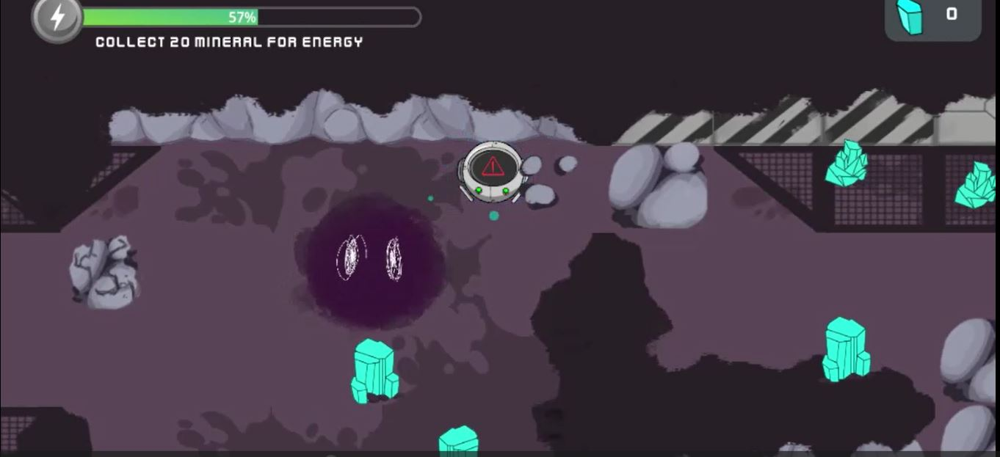
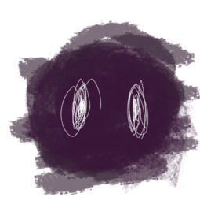
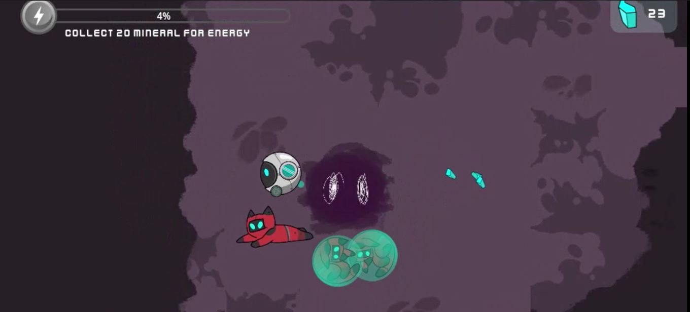

# Juego Final

# Descripción
En esta versión final del juego, se alcanza la cima de la experiencia de juego al introducir un elemento de desafío adicional: el enemigo de la nube tóxica. Esta amenaza implacable agrega un nuevo nivel de tensión y emoción al laberinto, creando un escenario en el que los jugadores deben enfrentar múltiples desafíos simultáneamente.

La nube tóxica es un enemigo formidable que puede atravesar paredes y objetos, persiguiendo al robot protagonista con el objetivo de oxidarlo y restarle vida. Ahora, además de recolectar gatos y regresar al punto inicial, los jugadores deben evitar el contacto con la nube tóxica para mantenerse con vida y tener éxito en su misión de rescate.

La barra de vida se convierte en una herramienta esencial en esta versión final, ya que los jugadores deben equilibrar la recolección de gatos con la evasión de la nube tóxica. Cada movimiento y decisión se vuelven cruciales, ya que una mala elección podría resultar en el contacto con la nube y el deterioro de la vida del robot.

Los diamantes adquieren aún más importancia, ya que recogerlos ahora tiene un doble propósito: no solo regeneran vida, sino que también se convierten en una estrategia para mantenerse fuera del alcance de la nube tóxica. Los jugadores deben decidir cuándo y dónde recolectar diamantes para maximizar sus posibilidades de supervivencia y éxito en la misión.