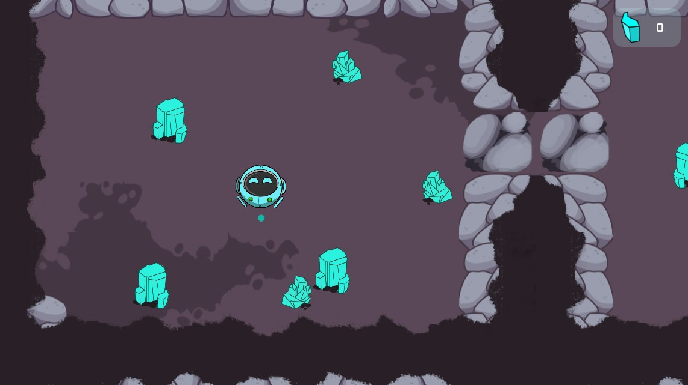
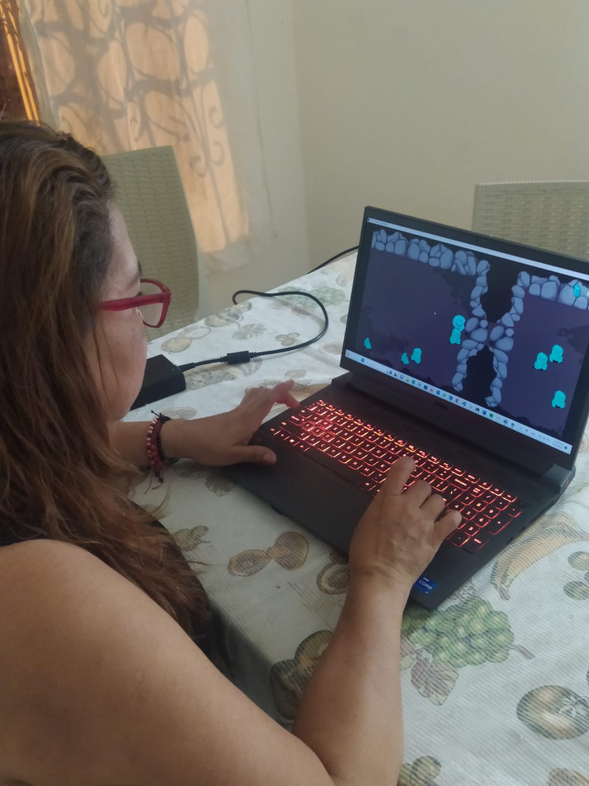
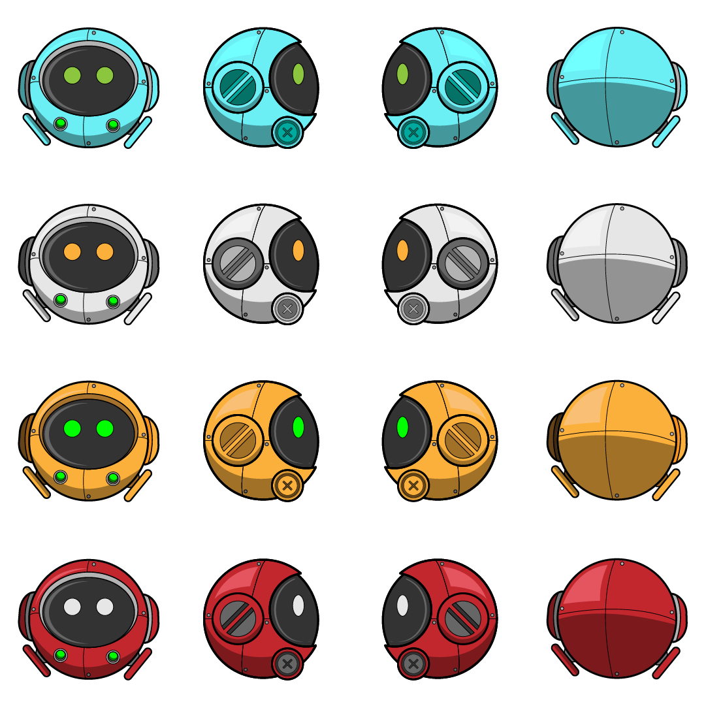
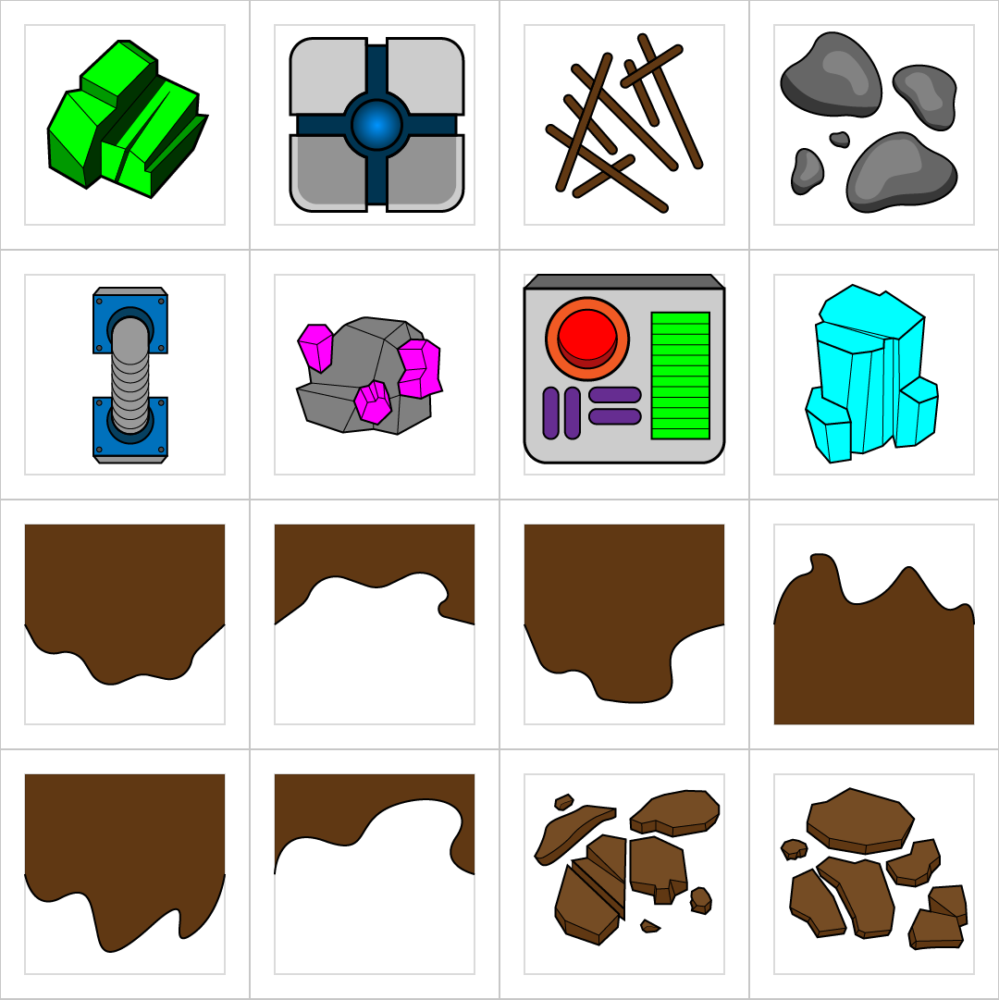

# Playtesting 1 

Este playtesting se realizo con la primera version del juego. En este solo se pueden ver los diamantes y el robot, el objetivo es romper los diamantes grandes y recolectar los mas pequeños. A medida que recoge los diamantes aumenta el contador, el cual esta en la esquina superior de la pantalla. 

## Sesion

Se le explico la dinamica del juego y recolecto todos los diamantes en 5 minutos. 

## Descubrimientos
 - Esta version es muy aburrida ya que no hace nada mas que recolectar los diamantes. 
 - El diseño le parece muy bonito pero cree que el color del robot no deberia ser igual al de los diamantes. 
 - Le gustaria que fuera mas largo y que recolectaran mas cosas. 
 - Piensa que es aburrido si no tiene ningun sonido. 
 - No se sabe en que momento se gana o se pierde. 

## Cambios

 Despues de esta prueba cambiaron muchas cosas con respecto al diseño. Por ejemplo: 

### Se pretende cambiar el color del robot 

Se diseñaron diferentes robots con diferentes colores, para utilizar uno diferente en la siguiente version. 

### Se diseñaron nuevos elementos para el juego 

Se diseñaron nuevos objetos. 

