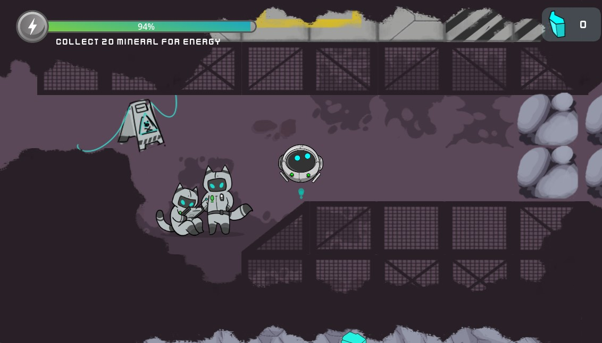
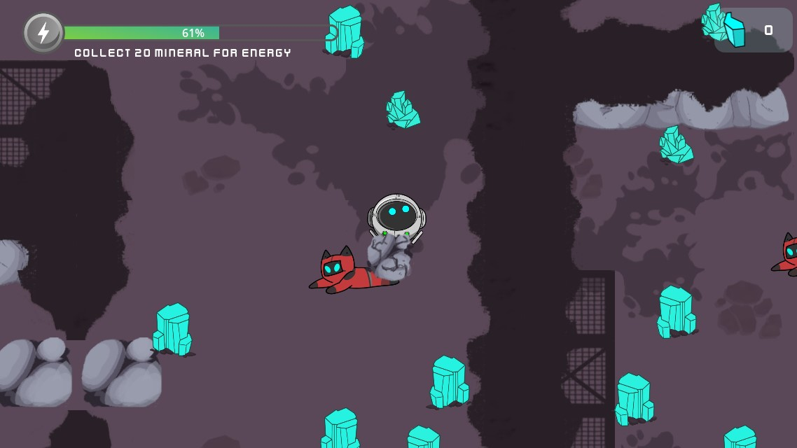
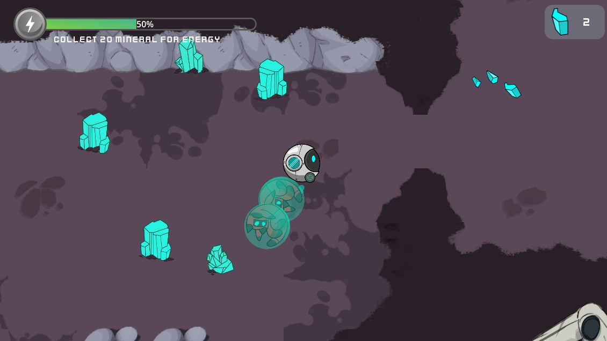
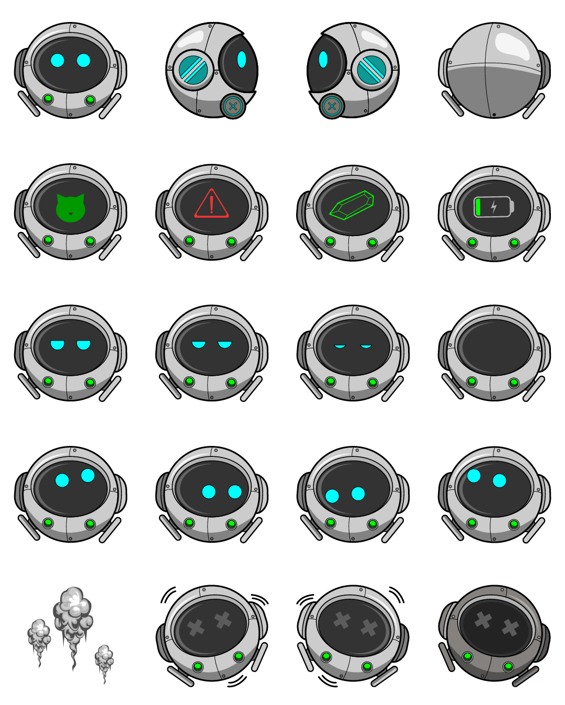
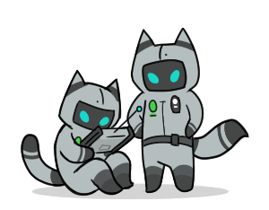
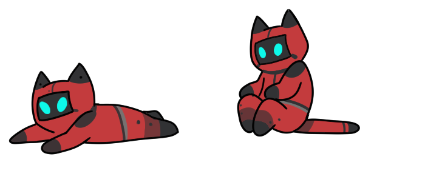
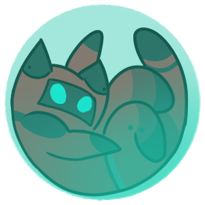
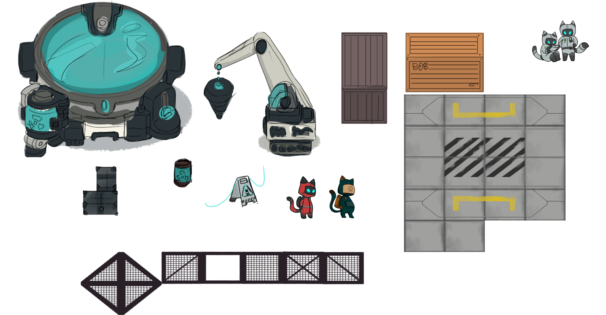
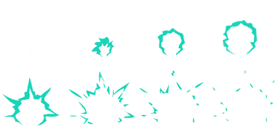
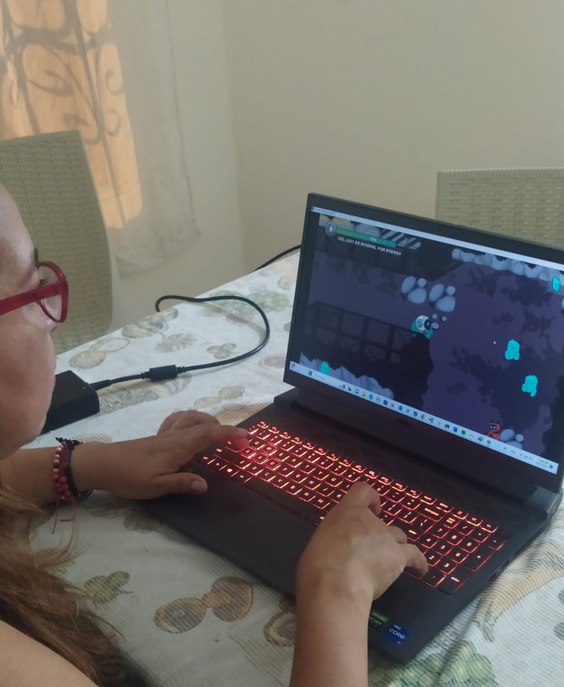

# Playtesting 2

Este playtesting se realizo con la sexta version del juego. En esta ocasion existe una barra de energia y el mismo sistema de recoleccion de puntos. Se cambiaron muchos objetos del ambiente y se rediseño el robot. Asi mismo, se agrego un nuevo personaje, el gatito a ser rescatado. Ahora el robot debe rescatar los gatitos atrapados en la cueva. 

Proceso de recoger gatitos: 

## Cambios previos al playtesting

### Cambio de personaje principal 

Se cambio el color y se rediseño el personaje principal del robot. Tambie se le agregaron mas estados y reacciones al robot. 

### Gatitos en apuros 

Gracias al playtesting anterior agregamos un nuevo personaje en el juego, los gatos a ser rescatados y los gatos dueños de la exploracion.                            

Los gatos atrapados en la cueva tienen dos estados. El estar atrapados como se muestra en la imagen. 

Y rescatados, como se muestra en la imagen. Cuando el robot rompe la roca, pasa sobre el gatito y lo recoge. 

### Nuevos objetos 

Debido a los comentarios del playtesting anterior, donde los objetos y el escenario del juego le parecia monotono, se agregaron nuevos objetos en todo el mapa.

Tambien se cambio la animacion de ataque del robot. 

## Sesion 

Se le explico la dinamica del juego y los nuevos personajes. 

## Descubrimientos
 - Le parece mucho mas interesante el rescatar los gatitos.
 - No se entiende muy bien la dinamica de recargar la energia. 
 - No es muy intuitivo que la energia se agota cada vez que el robot utiliza el poder. 
 - El diseño le parece mucho mas bonito e interesante. 
 - El juego dura un poco mas y la persona se ve mas interesada. 
 - Aun se siente mononoto ya que no tiene sonido. 

## Cambios despues del playtesting 

- Se espera agregar sonido. 
- Se espera agregar un villano 
- Se espera equilibrar la mecanica de la perdida de energia. 
