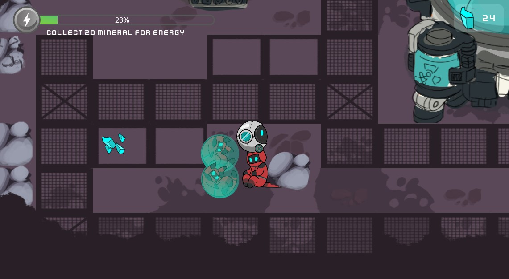
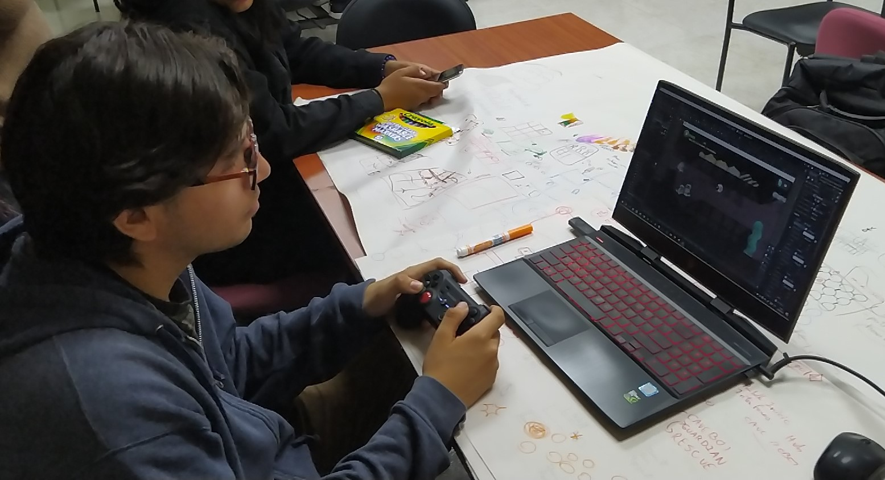
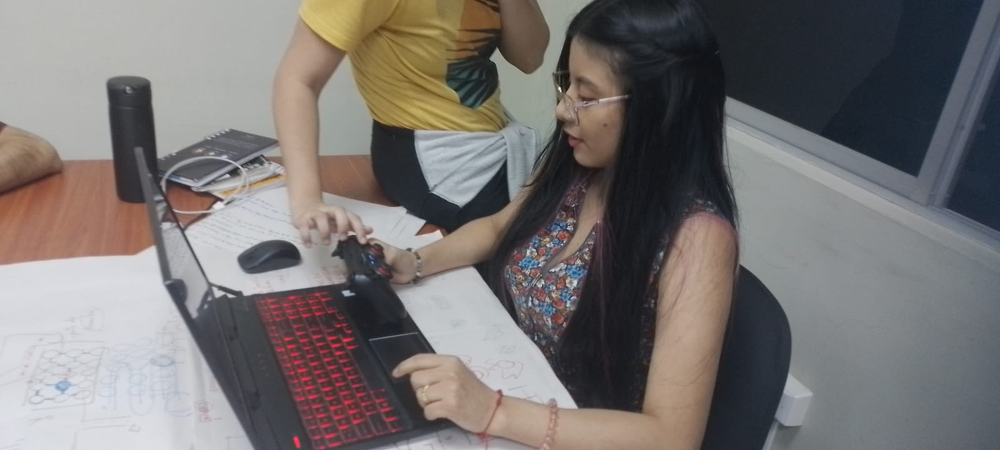
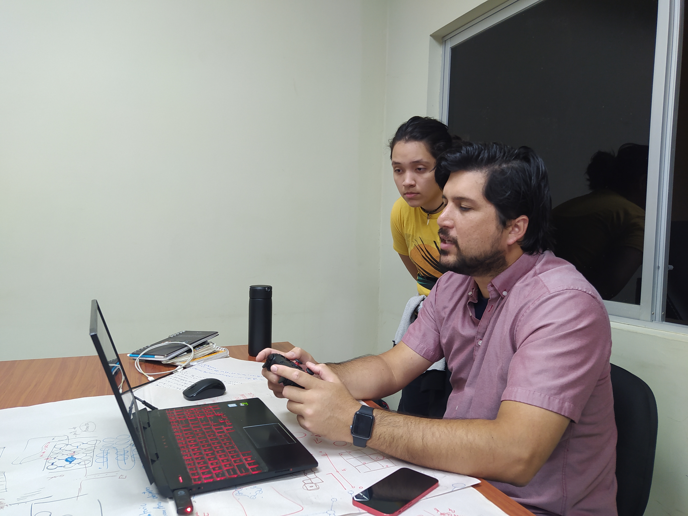
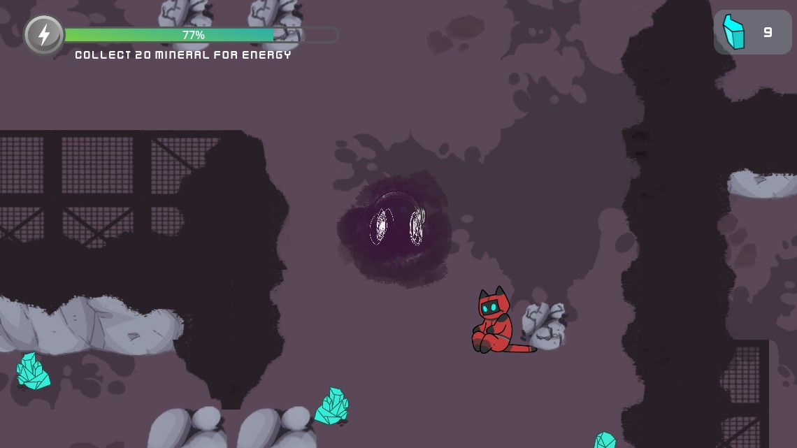
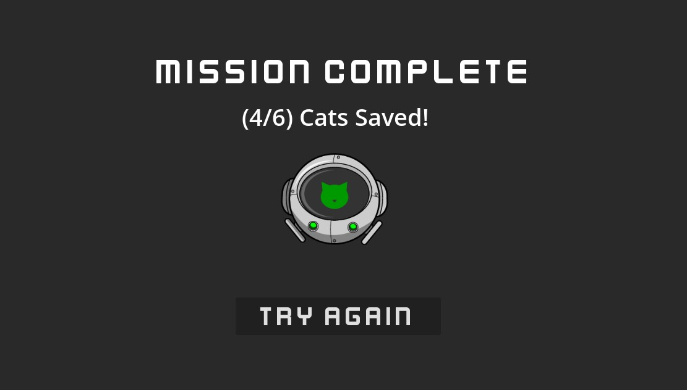
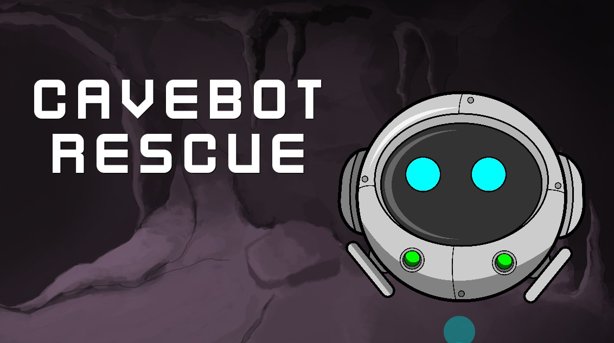

# Playtesting 3 

Para esta sesion de playtesting tambien se uso la sexta version del juego. En esta ocasion el juego posee musica de ambientacion. Se mantiene la dinamica de recolectar gatitos y recoger diamantes para subir la energia. 

## Sesiones 

### Prueba 1 

*** Comentarios ***
- El juego termina muy rapido y es muy facil 
- Termino el juego en 2 minutos. 
- No entendio la dinamica del juego. No se entiende que debe recoger los gatos. 
- No se entiende para que sirven los diamantes. 
- El diseño es bonito. 

### Prueba 2

*** Comentarios ***
- Le parece muy divertido. 
- Le gusta el diseño del mapa y de los personaje. 
- La dinamica de recoger gatitos le parece bonita e interesante. 
- No temrino el juego, no recolecto todos los gatos. 

### Prueba 3
-

*** Comentarios ***
- No hay retos en el juego. 
- Le parece poco interesante. 
- Se deberia aumentar algun conflicto en el juego, no solo la perdida de recursos. 
- El mapa es muy pequeño, se termina muy rapido y es predecible. 
- No es interesante si no tiene algun enemigo o dificultad extra. 

## Descubrimientos 

- El juego no tiene retos y es poco interesante. 
- La disminucion de la energia no es suficiente, ya que en un ocasion fue posible acabar la partida sin tener que recargar la energia. 
- Necesita un villano o alguna dificultad extra. 
- Aumentar la tension de la partida para que sea mucho mas entretenida. 

## Cambios 

### Se creo un villano 
Esta primera version del enemigo persigue al jugador cada vez que dentra en su rango de ataque. Si el enemigo toca al robot le quita energia mucho mas rapido. 

### Se aumento la dificultad 
Ahora debe rescatar 4 gatitos para poder ganar la partida.

### Se creo un meno de inicio 

