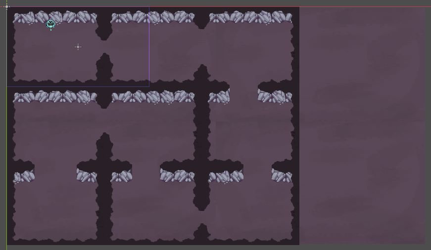
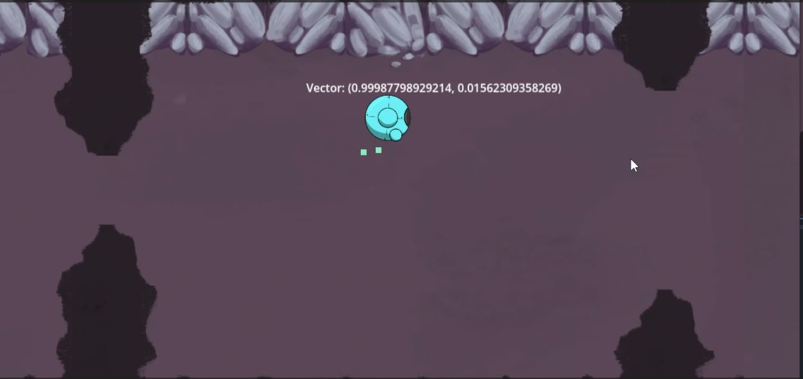

# Primera Versión

## Descripción

En esta primera versión del juego, el foco principal se centró en establecer las bases de la experiencia de juego. Se introdujo al personaje principal en un laberinto. Es compuesto por paredes que crean un escenario fascinante. Los jugadores pueden controlar al personaje y moverlo a través de este laberinto, explorando las diversas rutas y caminos que se presentan. La mecánica principal se centra en la capacidad de moverse libremente por el escenario, navegando por pasillos estrechos y buscando posibles salidas. Esta versión establece la base para futuras iteraciones al brindar a los jugadores la oportunidad de familiarizarse con los controles y la dinámica del juego.

