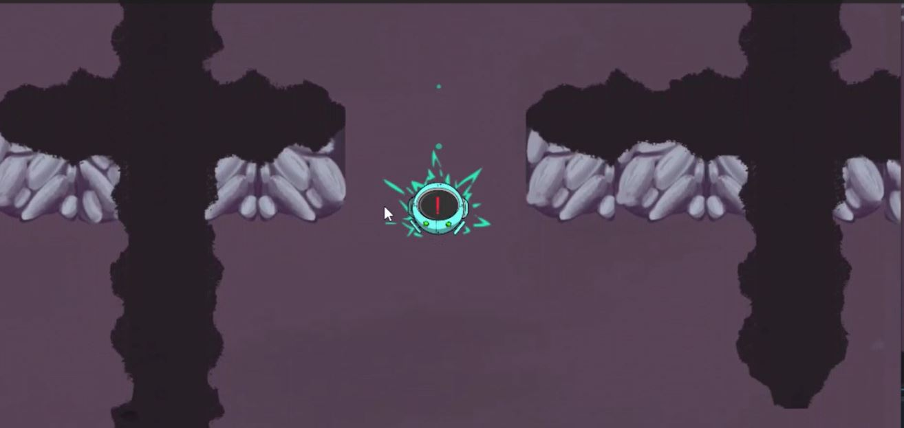

# Segunda Versión

## Descripción

En esta segunda iteración del juego, se enfocó en enriquecer la experiencia de juego al expandir y detallar el entorno del laberinto. Se amplió el mapa del laberinto, agregando más pasillos, áreas y posibilidades de exploración.
El personaje principal, un enigmático robot, recibió mejoras significativas. Se implementaron animaciones que añaden vida y personalidad al personaje, como el parpadeo de sus ojos que resalta su naturaleza robótica.
Además se introdujo un sistema de colisiones alrededor del cuerpo del robot. Esto proporciona una sensación más realista y coherente en el mundo del juego, lo que significa que el robot interactuará de manera adecuada con su entorno.