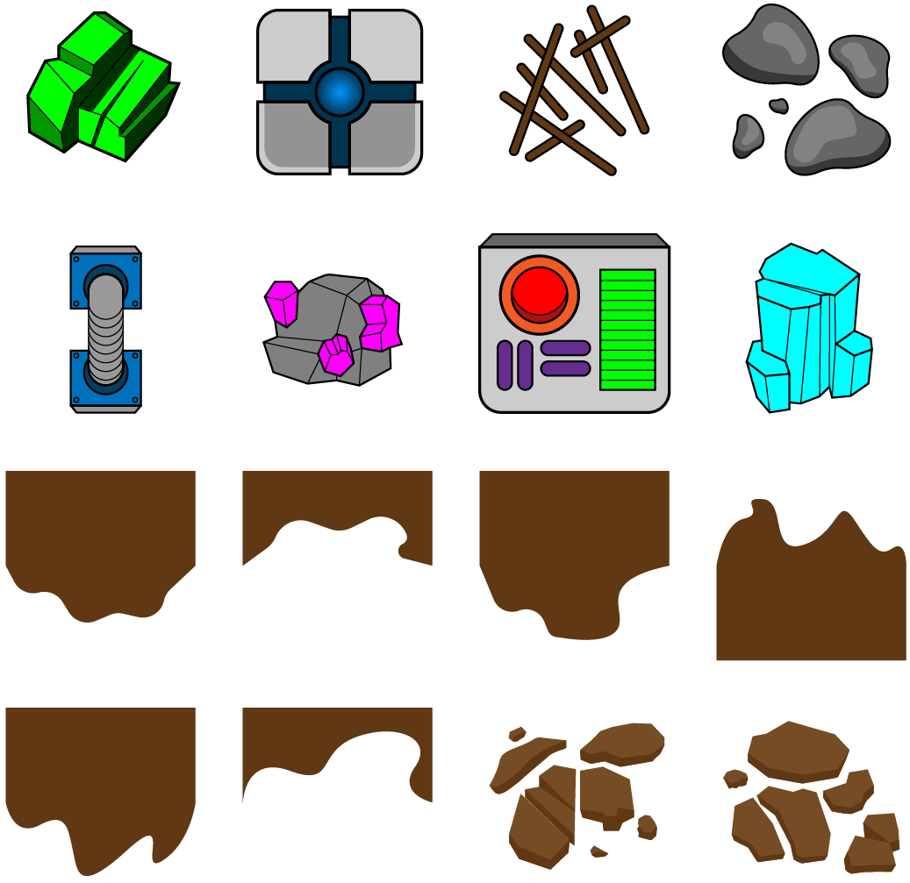
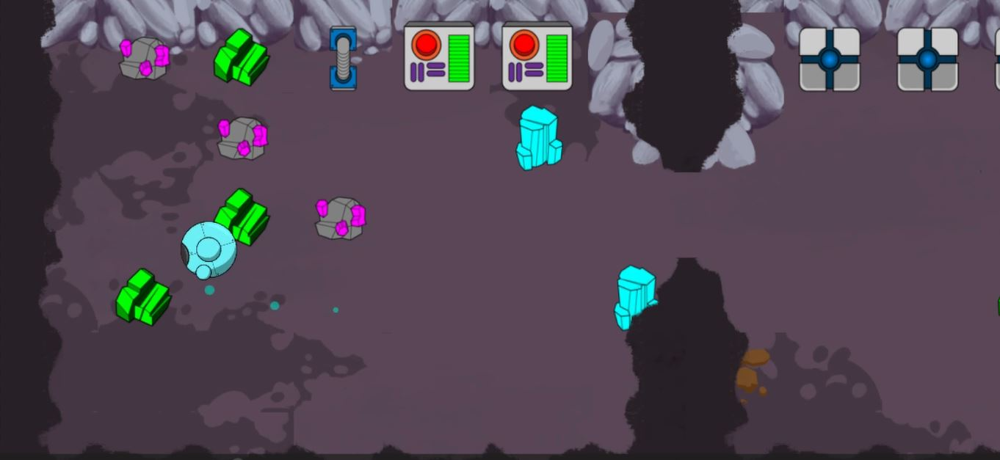

# Tercera Versión

## Descripción

En esta Tercera iteración del juego, se realizó un esfuerzo significativo para mejorar la calidad visual y la jugabilidad general del juego. Se introdujeron sprites, que son elementos visuales que enriquecen el mundo del juego y añaden elementos interactivos para los jugadores.
Se incorporaron artefactos de ayuda, como los valiosos diamantes. Estos diamantes tienen la función de regenerar la vida del personaje principal, lo que brinda a los jugadores una recompensa por su exploración y los incentiva a buscar estos preciados objetos.