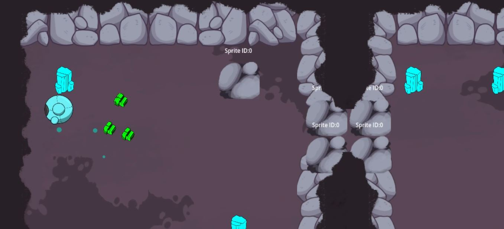
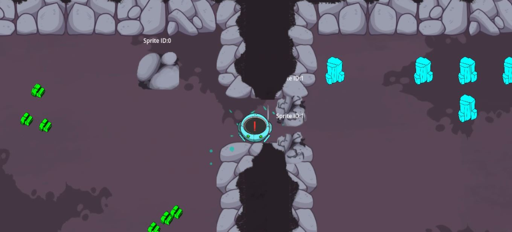

# Cuarta Versión

## Descripción

En esta cuarta iteración del juego, se llevó la interacción del personaje robot con el entorno a un nuevo nivel al habilitar la capacidad de romper objetos y obstáculos en su camino. Construyendo sobre la base de las colisiones implementadas en la versión 2.
Ahora, el robot puede usar su fuerza y capacidad para romper objetos y piedras que se interponen en su camino. Esta habilidad destrucción no solo agrega un elemento de satisfacción y poder al jugador, sino que también presenta nuevas oportunidades para resolver desafíos y avanzar en el juego. 