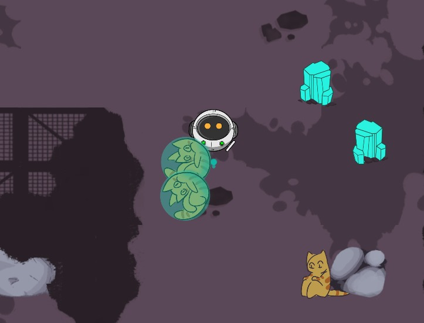
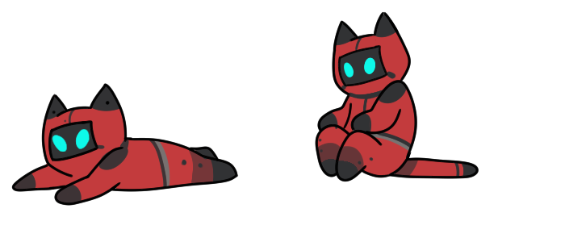

# Quinta Versión

## Descripción
En esta quinta iteración del juego, se introdujo una emocionante y conmovedora misión de rescate que agrega una nueva capa de jugabilidad y objetivos al mundo del laberinto. El enfoque principal de esta versión es la interacción del robot con los gatos atrapados bajo las rocas y objetos.

 

Los jugadores ahora tendrán la tarea de rescatar a los adorables gatos que están atrapados debajo de las rocas y obstáculos en el laberinto. Gracias a la habilidad de romper objetos que se implementó en la versión 4, el robot puede liberar a los gatos al destruir las rocas que los mantienen atrapados.
