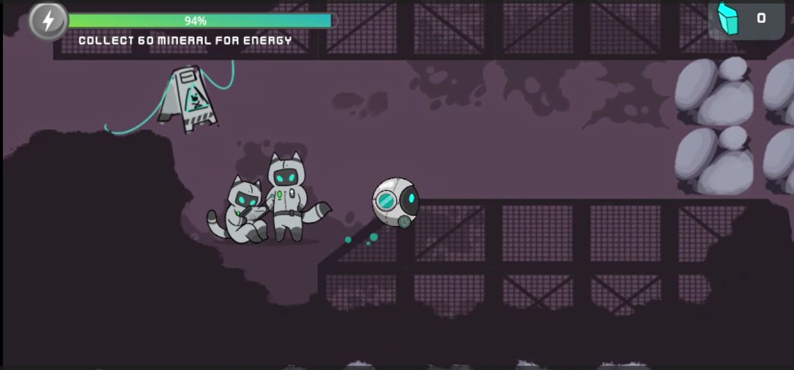
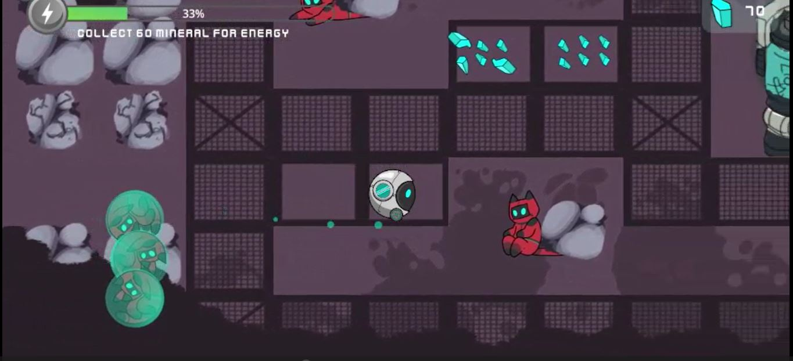
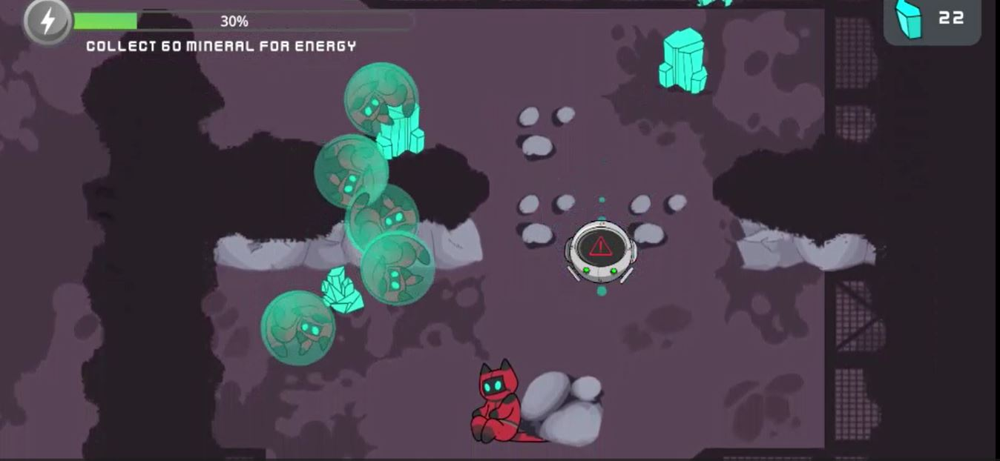
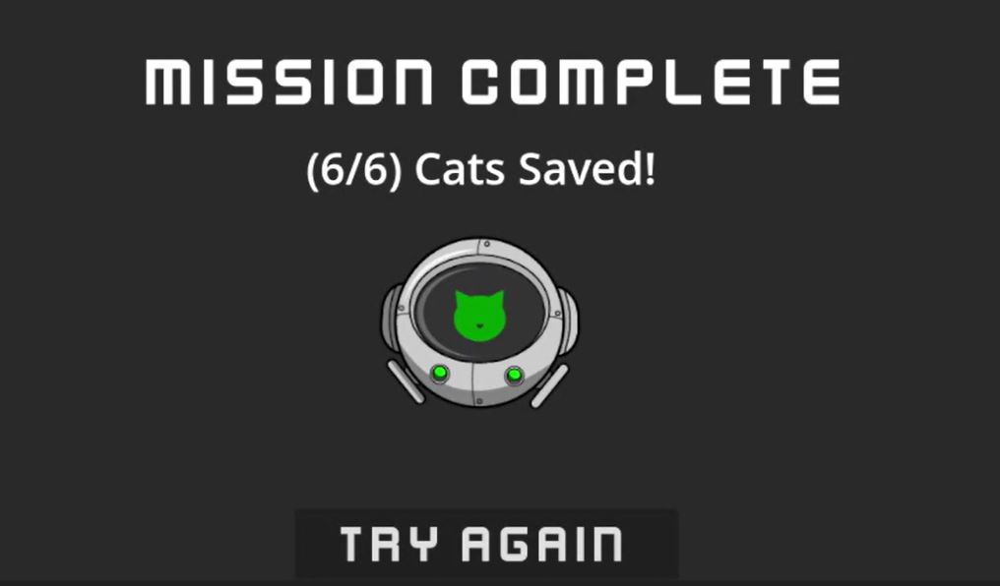

# Sexta Versión

## Descripción
En esta sexta iteración del juego, se introdujeron nuevos objetivos y desafíos que elevan la experiencia de juego a un nivel superior. Ahora, además de rescatar a los gatos y explorar el laberinto, los jugadores tienen la tarea emocionante de recoger a 6 gatos en total y llevarlos de regreso al punto de partida para completar la misión de rescate.

Para añadir un nivel de tensión y estrategia, se incorporó una barra de vida que comienza en 100 y disminuye con el paso del tiempo. Los jugadores deben administrar su tiempo con cuidado mientras rescatan gatos y exploran el laberinto, evitando que la barra de vida llegue a 0. Esta adición aumenta la urgencia y el desafío, requiriendo que los jugadores tomen decisiones rápidas y efectivas para completar sus objetivos.

La mecánica de los diamantes se expandió para brindar una solución al desafío de la barra de vida. Al romper y recolectar los diamantes dispersos por el laberinto, los jugadores pueden regenerar un 20% de la vida total, lo que les proporciona una oportunidad valiosa para prolongar su partida y continuar explorando.
